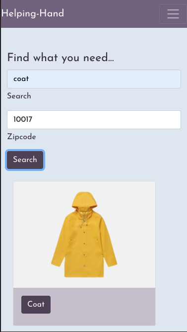
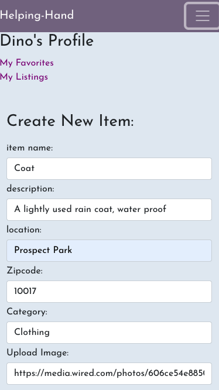
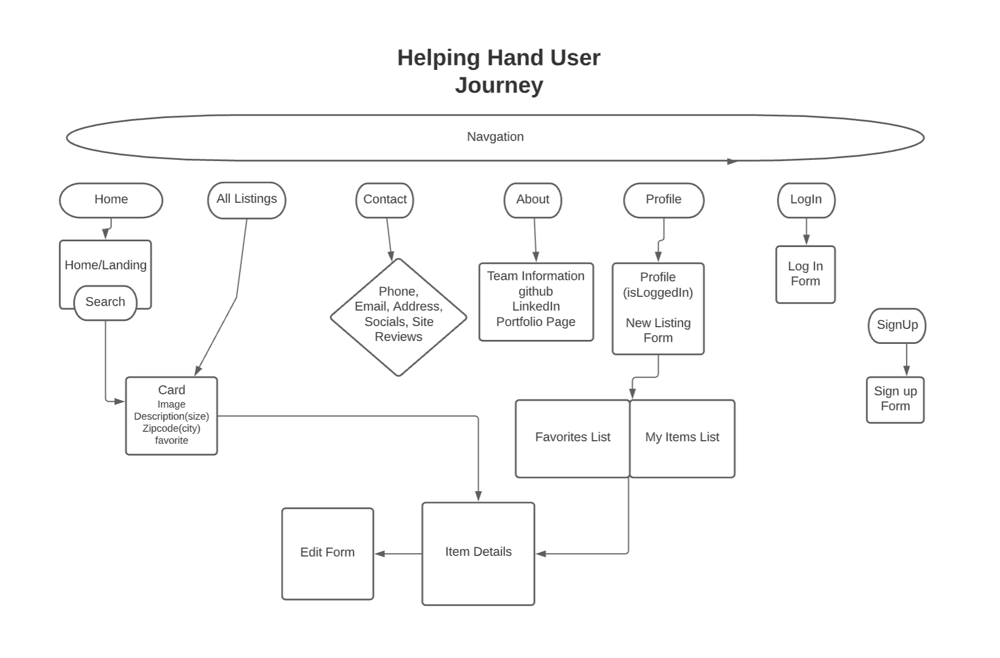
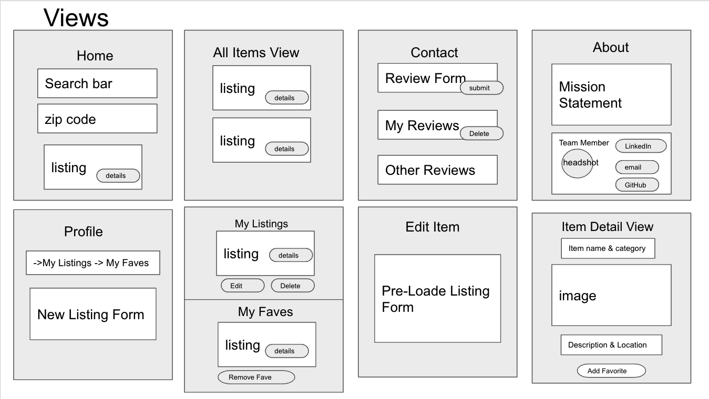
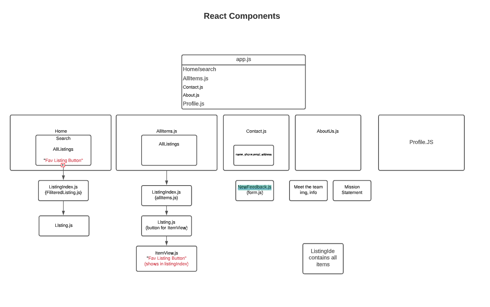

# Helping Hand - MERN Application




## Tech Stack
The Helping Hand application usese MongoDB to store a document based NoSQL database. Our server built with Express.js and Node.js connects our database to a React application that renders all of our views and forms for our users. We styled our application with components from React Bootstrap, and set our font Josefin Sans by Santiago Orozco, hosted on Google Fonts. We added font   Helping Hand's digital resources are stored on unique url's generatd by Cloudinary's upload API.

## Approach
Before writing our first line of code, our team spent about half of a day brainstorming, planning, and strategizing. We used Lucid Charts to brainstorm the views and components we would need, and then used it to record our desired user journey through the application.
We then moved to planning what React Componenets and Page Layouts we would need to bring our vision to life, mapping these out in Google Slides and Lucid Chart. We then created a To Do list and tracked task assignments in Trello, which we continued to use throughout our development process together.

We began every day by group debebugging and then working together to merge our code into our git manager's main repository. We would then move into peer programming for the rest of the morning, and break of into group programming after lunch. We would then end the day by merging our code again, and assigning tasks for the evening. We prioritized our team's well being by taking breaks at regular intervals.

## Installation instructions.

Install node packages for the helpingHand React app: ```npm i axios boostrap react-bootstrap react-router-dom  sass uuid web-vitals --save @fortawesome/fontawesome-svg-core --save @fortawesome/free-solid-svg-icons --save @fortawesome/react-fontawesome```


## User Stories

Our users are community members who want to use their surplus goods to meet the needs of their community members. Helping hand gives these users the tools to find the right information for meeting one another's needs wihtout having to look outside their own community. That's why we created our app with two primary user experiences in mind: 

Posting a Listing: As a user, I want to sign up using my email address so I can create an account on the platform to create a listing to give away my resources for people in need.

Finding an Item: As a user, I want to be able to find items I need in my community, and refine my search by category and zipcode.

## Wire Frames

### User Journey


### Application Views


### React Components



## Overcoming Roadblocks

Our team encountered a few roadblocks when developing Helping Hand. One of most time consuming was getting our .map() array method to stop throwing an error when passing our data into components. We solved the issue by pivoting away from passing all of our data down from props to doing more API calls to our database inside of the components which needed the data.

Another roadblock we encountered was finding the most efficient way to store and reneder information about user's lists of favorite items. We decided to nest the favorites doucments inside of their respective user documents. We discovered that we could use .populate in our server to render the entirity of the item objects based off of the id's in the user's favorites array.

